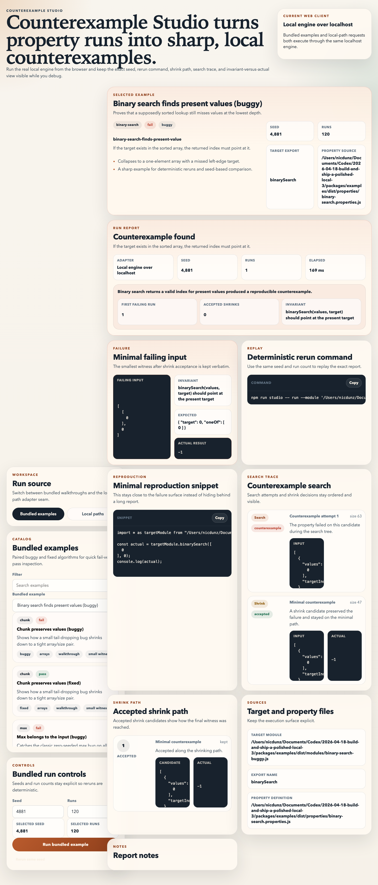

# Counterexample Studio

<p align="center">
  
</p>

Counterexample Studio is a local-first property-based testing workbench for JS/TS pure synchronous functions. It takes the part that usually feels fuzzy in property testing, finding a small, reproducible failure and explaining how the shrinker got there, and makes it obvious in both a CLI and a local web UI.

You point it at a target module plus a typed property file. It gives you a deterministic seed, a minimal counterexample, the accepted shrink path, the search trace, an exact rerun command, and a small reproduction snippet you can paste into a debug session or review thread.

Everything runs locally. There are no external APIs, no cloud services, and no telemetry.





## Why it matters

Property-based testing is great at telling you that an invariant broke. It is usually much worse at turning that into something you can immediately rerun, explain, and fix. Counterexample Studio is meant to close that gap:

- it keeps the failing input small and visible
- it keeps the deterministic replay details up front
- it makes the shrink story inspectable instead of magical
- it ships with paired buggy and fixed examples so the tool proves itself before you aim it at your code

## v1 scope

- JS/TS targets only
- Pure synchronous functions only
- Typed property config in TypeScript
- Local execution only
- Six bundled algorithm families, each shipped in buggy and fixed form

## Quickstart

Requirements:

- Node 22+
- npm 10+

```bash
npm install
npm run build
npm run studio -- example list
npm run studio -- example run chunk-buggy
npm run studio -- report --example chunk-buggy --out-dir reports
npm run studio -- ui --open
```

The local UI serves at [http://127.0.0.1:4173](http://127.0.0.1:4173).

## What the workflow looks like

1. Start with a bundled failing example to see the surface area.
2. Compare it against the paired fixed example with the same property and deterministic seed.
3. Point the CLI or browser at your own module and property file and keep the rerun command visible while you debug.

## Demo Proof

This is a real bundled failure from the current repo:

```text
FAIL  Chunk preserves all values
Seed: 87492311
Rerun: npm run studio -- run --module './packages/examples/dist/modules/chunk-buggy.js' --properties './packages/examples/dist/properties/chunk.properties.js' --case 'chunk-preserves-values' --seed 87492311 --path '0:0:0'
Invariant: flatten(chunk(values, size)) should equal the original values
Failing input: {
  "values": [
    0
  ],
  "size": 2
}
Actual: []
Shrink path: 0:0:0
```

The repo also commits generated reports you can inspect directly:

- [chunk Markdown report](reports/chunk-buggy-chunk-preserves-values.md)
- [chunk JSON report](reports/chunk-buggy-chunk-preserves-values.json)
- [fixed chunk Markdown report](reports/chunk-fixed-chunk-preserves-values.md)
- [fixed chunk JSON report](reports/chunk-fixed-chunk-preserves-values.json)
- [binary search Markdown report](reports/binary-search-buggy-binary-search-finds-present-value.md)
- [binary search JSON report](reports/binary-search-buggy-binary-search-finds-present-value.json)

The bundled example matrix is also executable as one local smoke test:

```text
PASS  chunk-buggy          expected=fail actual=fail seed=87492311   path=0:0:0
PASS  chunk-fixed          expected=pass actual=pass seed=87492311   path=n/a
PASS  max-buggy            expected=fail actual=fail seed=99131      path=0
PASS  max-fixed            expected=pass actual=pass seed=99131      path=n/a
PASS  interleave-buggy     expected=fail actual=fail seed=7712       path=0:1
PASS  interleave-fixed     expected=pass actual=pass seed=7712       path=n/a
PASS  rotate-left-buggy    expected=fail actual=fail seed=31008      path=3:2:3:2:5
PASS  rotate-left-fixed    expected=pass actual=pass seed=31008      path=n/a
PASS  binary-search-buggy  expected=fail actual=fail seed=4881       path=0
PASS  binary-search-fixed  expected=pass actual=pass seed=4881       path=n/a
PASS  merge-ranges-buggy   expected=fail actual=fail seed=16384      path=0:1:6
PASS  merge-ranges-fixed   expected=pass actual=pass seed=16384      path=n/a
```

## CLI

Run a bundled example:

```bash
npm run studio -- example run binary-search-buggy
```

Generate reproducible JSON and Markdown reports:

```bash
npm run studio -- report --example chunk-buggy --out-dir reports
```

Run against your own module and property file:

```bash
npm run studio -- run \
  --module ./src/math.ts \
  --properties ./src/math.properties.ts \
  --case clamp-stays-in-range \
  --seed 424242 \
  --runs 200
```

Useful subcommands:

- `npm run studio -- example list`
- `npm run studio -- example run <example-id>`
- `npm run studio -- run --module <file> --properties <file>`
- `npm run studio -- report --module <file> --properties <file> --out-dir reports`
- `npm run studio -- ui --open`

## Property config

Property files are plain TypeScript. You define the target export, generate inputs with `fast-check`, and describe the invariant in a way the tool can report clearly.

```ts
import { defineProperties, fc } from "@counterexample-studio/core";

interface TargetModule {
  readonly clamp: (value: number, min: number, max: number) => number;
}

export default defineProperties<TargetModule>({
  title: "Clamp contract",
  properties: [
    {
      id: "clamp-stays-in-range",
      label: "Clamp stays in range",
      functionName: "clamp",
      arbitrary: fc.record({
        value: fc.integer(),
        min: fc.integer({ min: -20, max: 0 }),
        max: fc.integer({ min: 1, max: 20 })
      }),
      renderInvariant: () => "clamp(value, min, max) should stay inside [min, max]",
      getArgs: (input) => [input.value, input.min, input.max],
      run: ({ fn, input }) => {
        const actual = fn(input.value, input.min, input.max);
        return {
          pass: actual >= input.min && actual <= input.max,
          expected: { min: input.min, max: input.max },
          actual,
          expectedLabel: "Allowed range",
          actualLabel: "Clamp result"
        };
      }
    }
  ]
});
```

## Web UI

The browser UI runs the same local engine the CLI uses. It keeps the debugging surface visible in one place:

- bundled example picker with paired buggy and fixed implementations
- local-file runner for your own module and property file
- deterministic seed and run count controls
- minimal failing input and actual result
- shrink path and search trace
- rerun command and reproduction snippet
- pass, fail, and blocked states with distinct output

## Bundled examples

Each family ships in buggy and fixed form so you can inspect a real failure and then compare it against the passing variant.

| Family | Property |
| --- | --- |
| `chunk` | flattening the chunk output must reproduce the original list |
| `max` | the reported max must come from the input and dominate it |
| `interleave` | leftover values must be preserved instead of truncated |
| `rotate-left` | full turns must match modulo-by-length rotation |
| `binary-search` | present values must be found in sorted input |
| `merge-ranges` | touching ranges must merge into the canonical result |

## Walkthrough: `chunk-buggy`

This is the sharpest first example in the repo.

Run it:

```bash
npm run studio -- example run chunk-buggy
```

What happens:

- the seeded example starts from `values = [1, 2, 3]` and `size = 2`
- the shrinker drives that down to the minimal failing witness `values = [0]` and `size = 2`
- the invariant is `flatten(chunk(values, size)) should equal the original values`
- the buggy implementation returns `[]`, so the tail value is lost
- the saved counterexample path is `0:0:0`

## Validation

Optional one-time browser setup for faster local end-to-end checks:

```bash
npm run playwright:install
```

Full repo verification:

```bash
npm run verify
```

The full gate set is still available individually:

```bash
npm run lint
npm run typecheck
npm run test
npm run build
npm run demo:examples
npm run e2e
```

CI lives in `.github/workflows/ci.yml` and mirrors the same validation bar.

## Repo assets

- Repo mark: `assets/repo-mark.svg` and `assets/repo-mark.png`
- Social preview: `assets/social-preview.svg` and `assets/social-preview.png`
- Screenshot: `assets/screenshots/workbench.png`
- Demo GIF: `assets/demo.gif`

## License

MIT
